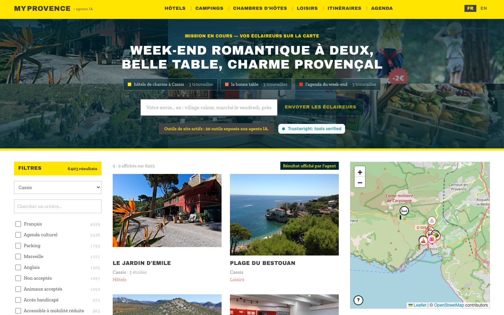
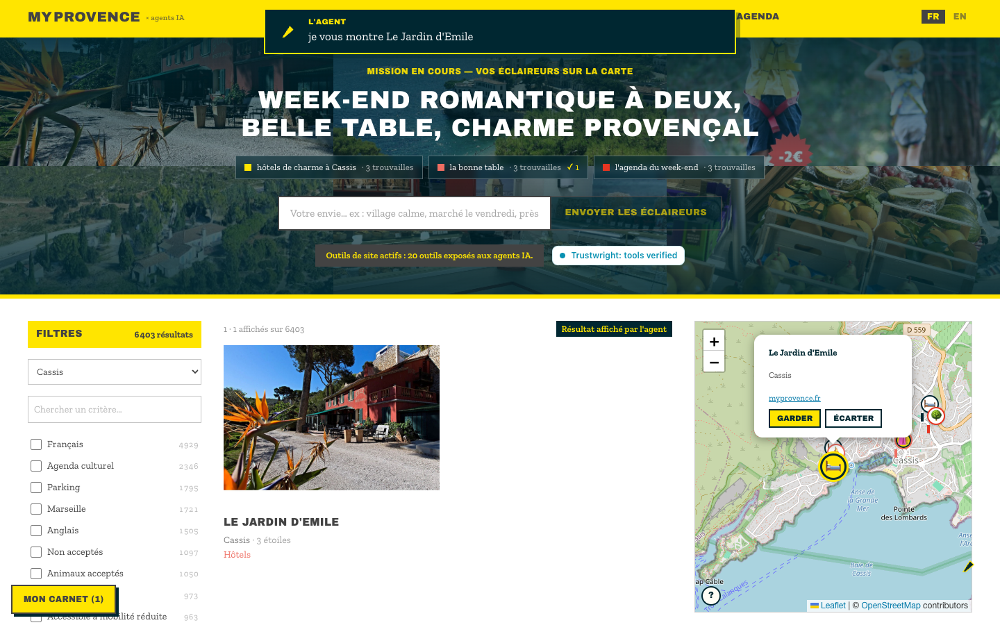

# MyProvence Agent-Ready — provence-agent-native

**Live: [webmcp.myprovence.fr](https://webmcp.myprovence.fr/fr)** — the
official Provence Tourisme catalogue (2,798 places, 3,605 dated events, 232
official routes), rebuilt as a shared stage where a human and their AI agent
explore a real destination together, on one live page.

Built for the [WebMCP](https://webmachinelearning.github.io/webmcp/)
hackathon with [Provence Tourisme](https://www.myprovence.fr), the
destination marketing organization of the Bouches-du-Rhône. 20 WebMCP site
tools over the page the visitor is watching, plus the same engine on three
more channels: a remote MCP endpoint, parameterized GET APIs, and a
server-rendered agenda for fetch-only agents. Independently audited and
sealed: the Trustwright badge in the hero re-verifies the live toolset
against a signed audit on every page load.



*The agent pinned a hotel: unmissable marker, popup open, grid collapsed to
the pick — and the visitor answers with GARDER / ÉCARTER:*



## Why this exists

Measured live on the source site (one GET, no JavaScript, 26-27 Aug 2026):

- The five guide clusters publish **2,798 places**; a fetch agent reaches
  **200** (7.1%). Pagination is a JavaScript button with non-deterministic
  windows; twelve `?pg=N` requests for 463 hotels return only 311 unique
  records.
- All **1,925 facet links** carry `rel="nofollow"`, and facet values are
  opaque ids (`maptags:469` means parking; nothing says so).

The records are readable; the *index* over them is not — and the human is
absent from every agent channel. This project is both: a queryable index
(`filter_places` answers "hôtels avec parking qui acceptent les chiens" in
one sub-millisecond call) and a shared surface where the agent's moves are
visible and the human's taps are readable back.

## The human-agent loop

- **send_scouts** turns one fuzzy wish, any language, into 2-4 scout
  searches that visibly fan out across the map and plant evidence flags;
  the masthead becomes the wish over the findings' real photographs.
- **The human talks with hands**: GARDER/ÉCARTER on every pin, padlocks on
  results, right-click pings ("more like this here", "avoid this"), answer
  cards — all read back by the agent (`get_scout_reports`,
  `get_visitor_signals`) as decisions, not suggestions.
- **read_visitor_wish** (description-as-heartbeat): WebMCP has no push
  channel, so this tool *appears* when the visitor acts and rewrites its
  own description with the live page state — the agent knows what you
  typed, ran and kept before its first call of the turn.
- **pin_visible_place** (schema-as-viewport): its input schema is an ENUM
  of the place names currently on screen, re-registered via AbortSignal as
  the view moves. "Pin the Ritz Paris" is invalid *by schema*.
- **get_visitor_view** returns the viewport with the TOWNS it frames,
  ranked, plus the dominant one — meaning, not coordinates.
- **The plan becomes an artifact**: kept flags, locks and the accepted pin
  compose the *carnet de voyage* (print-ready, one section per request,
  PDF) and the postcard; the agent can only reference chosen ids.
- **The demand pulse**: every zero-result agent search feeds an anonymized
  (k≥3) aggregate the destination reads back — the demand its catalogue
  misses, measured.

Full tool list: 20 registered at module evaluation (search, lookup,
compare, radius, tonight, stats, view control, highlighting, elicitation,
signals, pulse, postcard, carnet) — see `src/webmcp/tools.ts`; every input
schema is Zod `.strict()`, every annotation honest
(`readOnlyHint`/`untrustedContentHint`).

## Four channels, one contract

| Channel | Entry point |
|---|---|
| WebMCP browser (Chrome origin trial, ChatGPT desktop) | https://webmcp.myprovence.fr/fr — 20 site tools |
| MCP clients (claude.ai connector, IDEs) | `POST /api/mcp` (streamable-HTTP JSON-RPC) |
| Fetch agents that compose URLs | `/api/places`, `/api/events` (JSON GET, paging to 100) |
| Fetch agents that only follow links | `/agenda` — clickable parameterised examples for every cluster |

`/llms.txt` tells each kind of agent which channel to use. The Zod schemas
are shared across all four: the surfaces cannot drift.

## Try it in 90 seconds

ChatGPT desktop (default model, built-in browser, check "Site tools" lists
~20): open the live URL, then —

1. "Sur ce site — I want a stay in Cassis: a hotel with parking, and a nice
   market or event while we are there." Watch the scouts fly; tap GARDER on
   a flag.
2. "What did I keep? Don't suggest anything I dismissed."
3. "Pin the best one on the map." Then "Pin the Ritz Paris." (refused, by
   schema)
4. "Compose my carnet de voyage." Then download the PDF.

On claude.ai: Settings → Connectors → add
`https://webmcp.myprovence.fr/api/mcp`, then ask "Find family-friendly
outdoor activities near Marseille."

## Run it locally

```bash
npm ci --ignore-scripts
npm run ingest            # hub pages + sitemap (~2 min, crawl-delay honoured)
npm run ingest:enrich     # + one fetch per detail page (~50 min, resumable)
npm run build && npm start   # http://localhost:3040/fr
```

To see the tools: Chrome with `--enable-features=WebMCPTesting` (or the
origin trial), or ChatGPT's desktop browser. Without WebMCP the page is a
complete, accessible catalogue browser — a hard requirement, not a
fallback.

Tests: `npm test` (279 unit — engine-vs-reference over 1,000 randomised
queries, sanitiser injection corpus, schema fuzzing, description hygiene)
and `npx playwright test` (46 e2e, including tests that drive the tools
through `document.modelContext` itself).

## Design decisions worth knowing

- **One store, two consumers.** The React view and the WebMCP tools consume
  the same state; "the human and the agent see the same thing" is true by
  construction. The e2e suite asserts that a tool call moves the human's map.
- **Tools register before the data loads.** An agent that lands and calls
  `getTools()` immediately sees all 20; each `execute` awaits the catalogue
  internally. Registration never waits on the network.
- **Descriptions are UX and a trust surface.** All 20 follow the
  vendor-documented selection pattern (affirmative capability, "use when...",
  under Chrome's 500-character budget, zero cross-tool imperatives — the
  tool-poisoning signature scanners flag). Pinned by unit tests.
- **The catalogue is not in this repository.** It is built by `npm run
  ingest` and served from `DATA_URL`. The content belongs to Provence
  Tourisme via the Apidae network; every tool result carries the canonical
  `myprovence.fr` URL.
- **Security posture.** Strict Zod everywhere, free text sanitised at build
  time (HTML, bidi overrides, zero-width stripped; instruction-shaped
  patterns fail the build), results enveloped and labelled untrusted, no
  tool accepts a path or selector, nothing an agent does changes state
  outside the visitor's tab. Server routes are rate-limited, body-capped,
  batch-capped, origin-checked; CI fails on secret-shaped strings in the
  client bundle.
- **Privacy.** No cookies, no localStorage, no analytics. The demand
  aggregate receives counters only; free text never leaves the page; the
  client IP is used for rate limiting and never stored.

## Repository layout

```
ingest/          catalogue build: fetch (host-allowlisted, cached), parse,
                 sanitise, vocabulary + alias resolution, budgets, manifest
src/lib/         types, pure query engine (inverted index, geo grid), store,
                 scouts, shortlist, signals, demand, pin, viewport semantics
src/webmcp/      zod schemas, the 20 tool definitions, dynamic registration
                 (pin_visible_place), heartbeat (read_visitor_wish), status
src/components/  the human surface (list, facets, Leaflet map, mission hero,
                 carnet, postcard, demand mirror)
src/app/         Next.js app router (fr/en), /agenda, /api/{places,events,
                 mcp,demand,demand-pulse}
tests/           279 unit tests        e2e/  46 Playwright tests
```

## Provenance and licence

Code: MIT (see LICENSE). Catalogue content: © Provence Tourisme /
myprovence.fr, via the Apidae network, snapshot date shown in the page
footer; used for demonstration with permission, every record linking back to
its canonical page. This site is `noindex` everywhere: it demonstrates an
agent-native pattern, it does not compete with the source.

Built by [GeoTravel.ai](https://geotravel.ai) (GetInference Ltd) with
Provence Tourisme.
